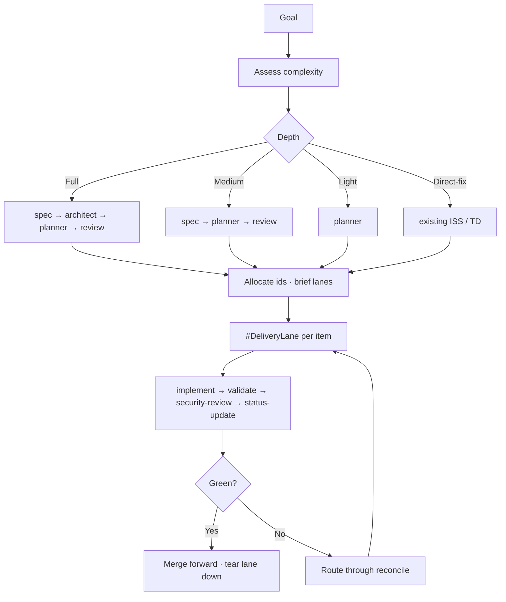

# Feature Blueprint: Orchestrated Delivery

## Feature Summary

A user hands over a goal and gets it delivered through delegated agents working in parallel without overwriting each other. This feature composes every foundation component into one flow: depth selection scales the planning stages, delegation isolates each lane in its own worktree with its own ports and stores, and a fixed delivery chain gates every item regardless of depth.

Serves `REQ-004` (workflow depth) and `REQ-012` (end-to-end orchestrated delivery), with `REQ-009`–`REQ-011` as the planning journeys it sequences.

## Component Blueprint Composition

This feature configures rather than reimplements. It composes `#AgentProfile` and `#RoleBoundary` from `FBP-FND-004` as the roles it dispatches, `#SkillDefinition` from `FBP-FND-003` as the procedures it assigns, `#GlobalPolicy` from `FBP-FND-007` as the contract every lane inherits, and `#HookScript` from `FBP-FND-005` as the reminder surface at each boundary.

What it adds is the coordination layer: the ledger, the lane lifecycle, and the sole-allocator rule.



## Feature-Specific Components

```component
name: OrchestrationLedger
container: Orchestrator Session
responsibilities:
	- Recording mode, active contract, stage chain, and next gate
	- Binding each lane to its `#DeliveryLane` resources and expected output
	- Recording every id allocated and the lane that owns it
	- Recording each death, hand-over, and resume point
```

```component
name: DeliveryLane
container: Consuming Repository
responsibilities:
	- Owning one worktree at `.worktrees/<record-id>` on branch `task/<record-id>`
	- Carrying `.orchestrator.env` with `ORCHESTRATOR_WT` and `ORCHESTRATOR_SHIFT_INDEX`
	- Holding WIP until its merge lands, independent of its runtime stack's lifetime
```

```component
name: IdAllocator
container: Orchestrator Session
responsibilities:
	- Reading the record index and taking the next unused number before dispatch
	- Passing the allocated ids into each brief so `#DeliveryLane` never mints one
	- Inventorying what a dead lane may already have written before re-dispatch
```

`#IdAllocator` is single-writer by construction, and that is the whole design. Parallel lanes reading the same index would both take the same number, and because ids are never recycled the collision would be permanent. Making the orchestrator the only allocator removes the race rather than detecting it — there is no reservation table to reconcile and no merge conflict to resolve.

`#DeliveryLane` carries the other non-obvious invariant: **one lane, two lifecycles**. The runtime stack holds no work and dies when its gate ends, pass or fail. The worktree holds WIP and survives until its merge lands. Removing the worktree early destroys work; leaving the stack up strands ports and data. Conflating the two is why leaked lanes happen.

`#OrchestrationLedger` is session state, but the lane binding is deliberately *also* recoverable from git alone — branch and worktree names carry the record id — so a compaction or restart that loses the ledger does not lose lane ownership.

## System Contracts

### Key Contracts

- The delivery chain runs at every depth; depth selection drops planning stages only.
- Every non-trivial slice is delegated into its own worktree; concurrent agents never share one.
- A lane that boots the application shifts every port and namespaces every store.
- The orchestrator is the sole id allocator; a lane returns a blocker rather than minting.
- The model tier is passed explicitly at every dispatch, derived from the item's own classification.
- A slice is complete only at an explicit checkpoint — a scoped commit plus a status note. Silence is incomplete.
- Worktree teardown happens after that lane's merge lands, never before and never batched to the end.
- A run does not close while a worktree, branch, or stack it created is outstanding.

### Integration Contracts

- **Host runtime**: supplies the sub-agent primitive and the model tiers; a runtime with no recorded tier binding runs the strong tier.
- **Consuming repository**: owns the isolated launch and stop paths that read `.orchestrator.env`. The feature allocates the identity; the repository owns the mechanism.
- **Feedback**: a downstream finding routes through `$reconcile` to the owning stage, never back into the lane as scope creep.

## Architecture Decision Records

- [ADR-FND-005](../ADR/ADR-FND-005.md) — Task decomposition hierarchy
- [ADR-FND-007](../ADR/ADR-FND-007.md) — Multi-agent protocol selection
- [ADR-FND-009](../ADR/ADR-FND-009.md) — Orchestration framework selection
- [ADR-FND-011](../ADR/ADR-FND-011.md) — Coordination level strategy
