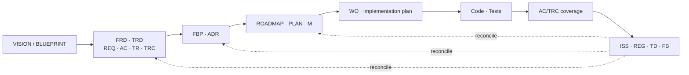

# Feature Blueprint: Record Schema and Artifact Flow

## Feature Summary

Every artifact this system produces carries an immutable id, and every id belongs to a typed record with required identity fields, a controlled vocabulary, and its own status set. This feature is the traceability substrate: it makes a requirement resolvable from a commit, a Work Order resolvable to the criteria it must satisfy, and a defect resolvable to the root cause that owns it.

Serves `REQ-009`–`REQ-011` (the planning journeys) and underwrites the traceability `REQ-012` depends on.

## Component Blueprint Composition

Composes `#GlobalPolicy` from `FBP-FND-007`, which owns the grammars and vocabularies, and `#IdAllocator` from `FBP-FEAT-001`, which is the only writer of a new id. This blueprint adds the record model and the one-way flow between artifact layers.



Solid edges are authorship: each layer is derived from the one before it. The dashed edges are the only way information travels upstream — through `$reconcile`, as an explicit reconsideration, never as a direct edit.

## Feature-Specific Components

```component
name: RecordIndex
container: Consuming Repository
responsibilities:
	- Holding one row per record with its identity fields and status
	- Serving lookup by scoped id, never wholesale reads
	- Splitting closed and decommissioned records into `docs/archive/development/`
```

```component
name: RecordDocument
container: Consuming Repository
responsibilities:
	- Carrying the prose a `#RecordIndex` row only summarizes
	- Holding a `REG`'s write-once reported behavior and closure matrix
	- Holding an `ISS`'s generalized diagnosis and remediation
```

```component
name: IdMap
container: Consuming Repository
responsibilities:
	- Resolving every pre-migration id to its successor, permanently
	- Recording which numbers are permanently unissued
```

The index/document split exists because the two are read at different scales: an orchestrator fanning out a Phase needs 40 rows and no prose, while a developer implementing one item needs the prose and no other rows. Merging them forces every reader to load both.

`#IdMap` is load-bearing rather than transitional. Historical ADRs, archived records, and prior reports keep their original ids because they record what was true when written; the map is the only thing that resolves them, so it is never retired.

## Data Models

```model
name: Record
store: Versioned markdown — index row plus optional document
description: The canonical shape every typed artifact shares.
fields:
	- id: string (required, immutable, never recycled)
	- type: REQ | AC | TR | TRC | FBP | ADR | WO | ISS | REG | TD | FB (required)
	- category: controlled vocabulary (required, project-extensible)
	- scope: controlled vocabulary (required, project-extensible)
	- title: string (required, <= 80 chars, rephrased never truncated)
	- status: the type's own vocabulary (required)
constraints:
	- id is immutable: never renumbered, recycled, or retyped
	- a retired record keeps its id and takes a terminal status
	- severity, priority, and complexity are fixed closed sets that never borrow each other's words
	- REG carries no severity — it inherits its ISS parent's
	- REG has exactly one current ISS parent; relinking appends history and never rewrites the report
	- a preserved number may leave a permanent gap in another type's sequence
```

## System Contracts

### Key Contracts

- Citation runs one way. A requirement body cites `REQ`/`AC`/`TR`/`TRC` and nothing else.
- A Work Order cross-references requirements by id with a brief description, never verbatim text.
- Every commit cites the immutable ids it serves.
- Blueprints never depend on execution artifacts as design sources.
- Only the status stage sets status; only the orchestrator allocates ids.
- Enforcement is review-time, not write-time: this package ships no allocator, so `$review` and `$validate` carry the vocabulary and referential checks.

### Integration Contracts

- **`$context-compiler`**: hydrates full requirement text on demand so no downstream artifact needs a copy.
- **`$reconcile`**: the only sanctioned upstream path; classifies a finding and names the owning stage.
- **Archive**: closed and decommissioned records move to `docs/archive/development/` and keep their ids.

## Architecture Decision Records

- [ADR-FND-005](../ADR/ADR-FND-005.md) — Task decomposition hierarchy
- [ADR-FND-012](../ADR/ADR-FND-012.md) — Governance rationalization
