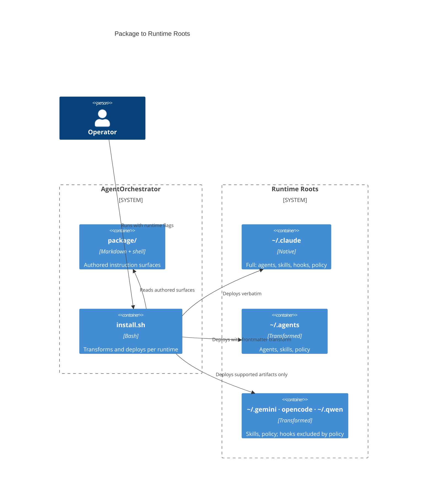

# Container Blueprint: Installed Runtime Root

## Container Summary

The installed runtime root is the deployment target: a directory under the user's home, or inside a project, that a host runtime reads its agents, skills, policy, and templates from. Each supported runtime has its own root, its own path conventions, and its own frontmatter dialect. This container is where one authored package becomes five valid installations.

## Infrastructure

Runtime roots and their capability profile are declared in `package/install/runtimes.sh`, the canonical registry. The installer reads that registry rather than hardcoding paths, so adding a runtime is a registry change plus a transform, not a rewrite.

| Concern | Mechanism |
|---|---|
| Path registry | `package/install/runtimes.sh` — conf dir, project dir, namespace mode per runtime and per artifact type |
| Frontmatter transform | strip unsupported keys; map tool names to the runtime's vocabulary |
| Namespacing | flat by default; dash-prefix or subdirectory per runtime's own support |
| Backup / restore | timestamped `.backup/<stamp>/`, restorable per runtime |
| Verification | `install.sh --check` for layout and registry declarations; `tests/install/smoke.sh` for post-install conformance |

## Entry Points and Boundaries

The container exposes exactly what the host runtime discovers: `agents/`, `skills/`, `policy/`, `templates/`, `workflows/`, and — on runtimes that support them — `hooks/`. It consumes nothing at runtime; the host reads it.

The boundary that matters is **capability presence**. A runtime that lacks hooks receives no hook files, and the drift check reports that as a `GAP` row rather than a failure. Emulating a missing capability by writing a file the runtime cannot load would convert a clean gap into a parse error.

## System Contracts

### Key Contracts

- The registry, not the installer body, declares every runtime path. A path that is not in the registry is not written.
- Install is idempotent: a second install over the same root produces the same result and no duplicate policy references.
- A namespaced install is fully reversible, removing exactly the artifacts it added.
- Hooks install only when explicitly requested, and only where the runtime's hook model supports them.

### Integration Contracts

- **Host runtime → container**: the runtime discovers artifacts by its own convention. The container conforms; it never asks the runtime to change.
- **Container → project**: project-tier policy and generated docs land in the consuming repository, never in the runtime root.

## Architecture Decision Records

- [ADR-FND-004](../ADR/ADR-FND-004.md) — Skill and agent invocation paths
- [ADR-FND-014](../ADR/ADR-FND-014.md) — Multi-runtime installer
