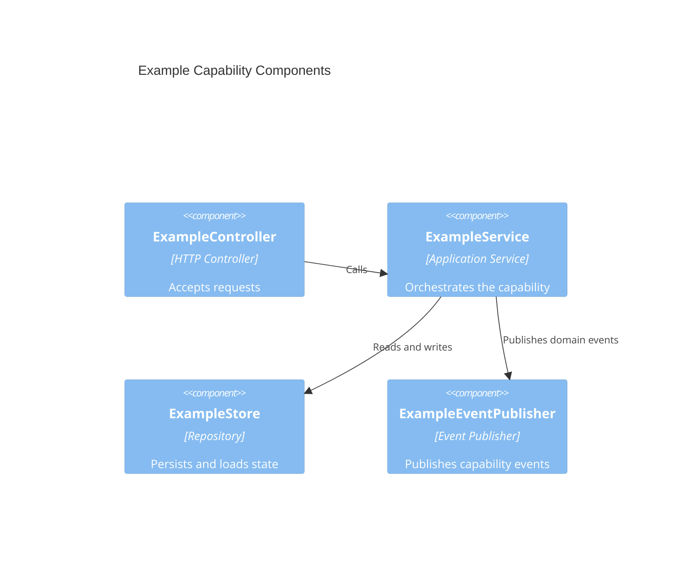

# Component Blueprint Template

## Capability Summary

Summarize the reusable capability in 2-3 sentences and name the key elements flowing through it.

## Core Components

```component
name: ExampleComponent
container: API Server
responsibilities:
	- Responsibility using `ExampleElement`
	- Collaboration with `#AnotherComponent`
```

Describe the relationship between concrete components, including direction, data flow, and why the interaction exists.

Add a focused diagram here when it materially improves clarity. Prefer a C4 component-style diagram for runtime structure inside or across containers.



## Data Models

Add this section when the capability owns or depends on a canonical model that multiple components read or mutate.

```model
name: ExampleAggregate
store: Postgres
description: Canonical capability model used across the component set.
fields:
	- id: UUID (required)
	- status: Draft | Active | Archived (required)
	- updated_at: datetime (required)
constraints:
	- unique `id`
	- `updated_at` changes on every mutation
```

## System Contracts

### Key Contracts

- List invariants, correctness rules, and reliability semantics.

### Integration Contracts

- List events, APIs, webhooks, and composition expectations.

## Architecture Decision Records

> ADRs are standalone files at `docs/architecture/ADR/ADR-FND-NNN.md`, never inline.
> Ids are immutable and allocated by the orchestrator (or the primary session when working solo) —
> read `docs/architecture/ADR/README.md` for the highest existing `ADR-FND` and take the next.
> Author the file with a `Blueprint:` back-link plus `Context`/`Decision`/`Consequences`, add it to the
> ADR index, and cross-reference it here:

- [ADR-FND-NNN](../ADR/ADR-FND-NNN.md) — Decision title
