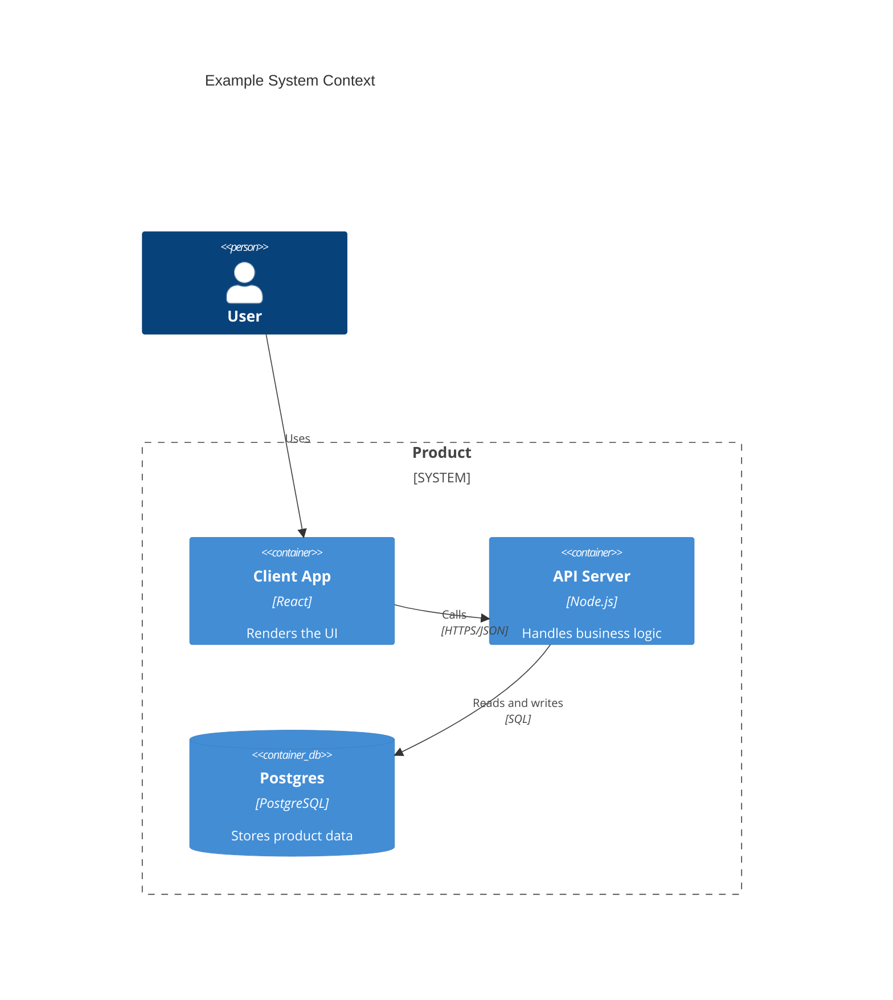

# Container Blueprint Template

## Container Summary

Summarize the deployable unit, its purpose, and its runtime role.

## Infrastructure

Describe the container's technology stack, runtime environment, and cross-cutting infrastructure concerns.

## Entry Points and Boundaries

Describe the interfaces this container exposes, consumes, and the boundaries it maintains with other containers.

Add a focused diagram here when it materially improves clarity. Prefer a C4 container-style diagram for container boundaries and external dependencies.

## System Contracts

### Key Contracts

- List invariants, correctness rules, and reliability guarantees.

### Integration Contracts

- List events, APIs, webhooks, or other external interfaces.

## Architecture Decision Records

> ADRs are standalone files at `docs/architecture/ADR/ADR-FND-NNN.md`, never inline.
> Ids are immutable and allocated by the orchestrator (or the primary session when working solo) —
> read `docs/architecture/ADR/README.md` for the highest existing `ADR-FND` and take the next.
> Author the file with a `Blueprint:` back-link plus `Context`/`Decision`/`Consequences`, add it to the
> ADR index, and cross-reference it here:

- [ADR-FND-NNN](../ADR/ADR-FND-NNN.md) — Decision title
