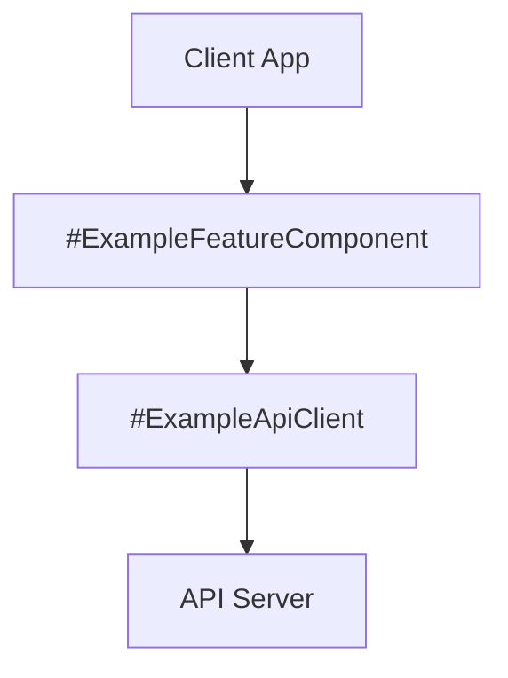
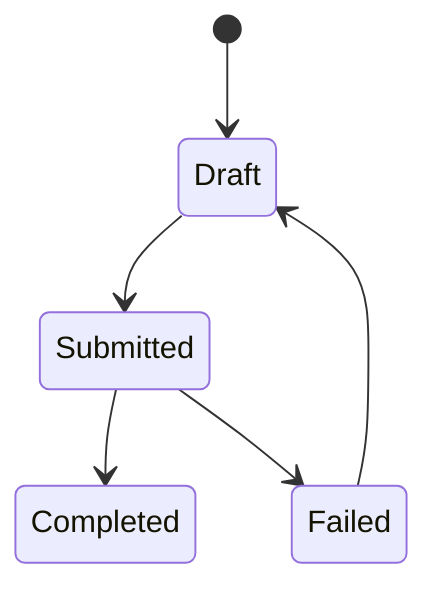

# Feature Blueprint Template

## Feature Summary

Summarize the feature in 2-3 user-centered sentences and reference the corresponding requirements document.

## Component Blueprint Composition

Describe which shared capabilities this feature composes and how each is configured or scoped. Name concrete `#components`, `elements`, and `@documents` where relevant.

Use prose by default. Add a focused diagram here when it materially improves clarity. Prefer `flowchart` for orchestration and request flow, and `stateDiagram-v2` for feature state/lifecycle behavior.





## Feature-Specific Components

```component
name: ExampleFeatureComponent
container: Client App
responsibilities:
	- Rendering the feature flow using `ExampleViewModel`
	- Calling `#ExampleApiClient` with `ExampleRequest`
```

Describe the relationships between feature-specific components and shared capabilities.

## Data Models

Add this section when the feature introduces or specializes a canonical model that is central to its behavior.

```model
name: ExampleFeatureRecord
store: Postgres
description: Canonical feature record that tracks lifecycle and user-visible state.
fields:
	- id: UUID (required)
	- owner_id: UUID (required)
	- status: Draft | Submitted | Completed | Failed (required)
	- submitted_at: datetime (nullable)
constraints:
	- unique `id`
	- `submitted_at` is present when `status` is not `Draft`
```

## System Contracts

### Key Contracts

- List invariants, correctness rules, and reliability semantics.

### Integration Contracts

- List events, APIs, and composition expectations specific to this feature.

## Architecture Decision Records

> ADRs are standalone files at `docs/architecture/ADR/ADR-FEAT-NNN.md`, never inline.
> Ids are immutable and allocated by the orchestrator (or the primary session when working solo) —
> read `docs/architecture/ADR/README.md` for the highest existing `ADR-FEAT` and take the next.
> Author the file with a `Blueprint:` back-link plus `Context`/`Decision`/`Consequences`, add it to the
> ADR index, and cross-reference it here:

- [ADR-FEAT-NNN](../ADR/ADR-FEAT-NNN.md) — Decision title
