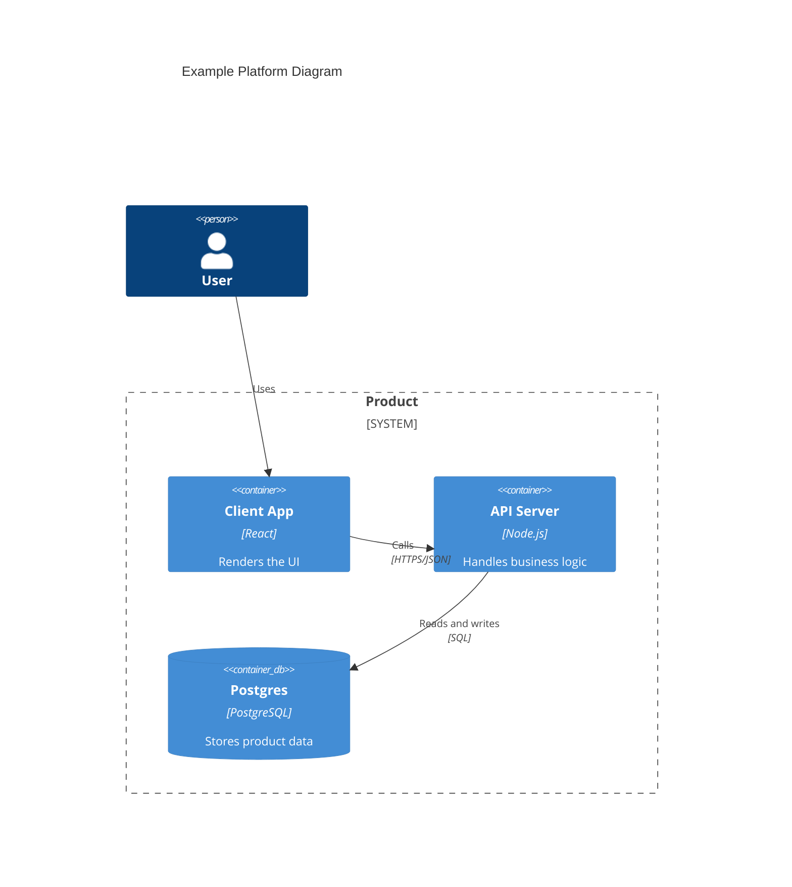

# System Diagram Template

Use this template for a single focused architecture or flow diagram in Foundry.

## Diagram Summary

Summarize what the diagram explains, why it matters, and the audience who should use it.

## Scope

- Systems, containers, or flows represented in the diagram
- Explicit exclusions to keep the diagram focused

## Diagram

Choose the Mermaid type that matches the intent of the diagram:

- `C4Container` for system/container boundaries and external dependencies
- `C4Component` for component structure inside a container or capability
- `flowchart` for request flow, orchestration, and control flow
- `stateDiagram-v2` for lifecycle or state transitions
- `erDiagram` for data relationships

## Notes

- Clarify important paths, assumptions, and interpretation rules

## Source Blueprints

- @Foundation Blueprint or @Feature Blueprint that this diagram supports
