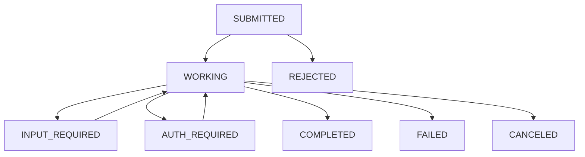

# Orchestrator: ACP vs A2A Capabilities Comparison

## Executive Summary

This report compares the **Session Management** and **Task State Management** capabilities of two protocols critical to the Orchestrator:

- **ACP** (Agent Client Protocol): Orchestrator ↔ Agent communication, from **Zed Industries**
- **A2A** (Agent2Agent Protocol): Agent ↔ Agent communication, governed by **Linux Foundation**

**Key Finding**: ACP and A2A serve different architectural purposes with distinct but complementary state management approaches:
- **ACP**: Session-centric, conversation-focused, synchronous request-response pattern
- **A2A**: Task-centric, work-focused, asynchronous lifecycle with rich state machine

---

## 1. Session Management Capabilities

### 1.1 ACP Session Management

**Source**: [Agent Client Protocol - Session Setup Documentation](https://agentclientprotocol.com/protocol/session-setup)

#### 1.1.1 Session Creation

**Method**: `POST /session/new`

**Required Parameters**:
- `cwd` (string): Working directory for the session (MUST be absolute path)
- `mcpServers` (array): List of MCP servers the agent should connect to

**Response**:
- Returns unique `sessionId` that identifies the conversation context

**Citation**:
```json
{
  "jsonrpc": "2.0",
  "id": 1,
  "method": "session/new",
  "params": {
    "cwd": "/home/user/project",
    "mcpServers": [
      {
        "name": "filesystem",
        "command": "/path/to/mcp-server",
        "args": ["--stdio"],
        "env": []
      }
    ]
  }
}
```

*Source: Context7 Documentation - [agentclientprotocol/agent-client-protocol](https://context7.com/agentclientprotocol/agent-client-protocol/llms.txt)*

#### 1.1.2 Session Persistence & Loading

**Method**: `POST /session/load`

**Capability Check**: Agents MUST advertise `loadSession: true` in initialization response

**Functionality**:
- Resume previous conversations
- Agent replays entire conversation history via `session/update` notifications
- Supports persistence across restarts
- Enables session sharing between different client instances

**Citation**:
> "Agents that support the `loadSession` capability allow Clients to resume previous conversations. This feature enables persistence across restarts and sharing sessions between different Client instances."

*Source: [ACP Session Setup](https://agentclientprotocol.com/protocol/session-setup)*

**Replay Mechanism**:
```json
{
  "jsonrpc": "2.0",
  "method": "session/update",
  "params": {
    "sessionId": "sess_789xyz",
    "update": {
      "sessionUpdate": "user_message_chunk",
      "content": {
        "type": "text",
        "text": "What's the capital of France?"
      }
    }
  }
}
```

*Source: Context7 Documentation - ACP Session Load*

#### 1.1.3 Session Context Management

**Session ID Usage**:
- Send prompt requests via `session/prompt`
- Cancel ongoing operations via `session/cancel`
- Load previous sessions via `session/load`

**Working Directory Boundary**:
- MUST be absolute path
- MUST be used regardless of where agent subprocess spawned
- SHOULD serve as boundary for tool operations on file system

**Citation**:
> "The `cwd` (current working directory) parameter establishes the file system context for the session. This directory: MUST be an absolute path, MUST be used for the session regardless of where the Agent subprocess was spawned, SHOULD serve as a boundary for tool operations on the file system."

*Source: [ACP Session Setup - Working Directory](https://agentclientprotocol.com/protocol/session-setup)*

#### 1.1.4 MCP Server Configuration per Session

**Transport Support**:
1. **Stdio** (Required): All agents MUST support
2. **HTTP** (Optional): When `mcpCapabilities.http: true`
3. **SSE** (Optional, Deprecated): When `mcpCapabilities.sse: true`

**Configuration Example**:
```json
{
  "name": "filesystem-tools",
  "command": "/usr/local/bin/mcp-filesystem",
  "args": ["--stdio"],
  "env": [
    { "name": "PROJECT_ROOT", "value": "/home/user/project" }
  ]
}
```

*Source: Context7 Documentation - ACP MCP Server Configuration*

#### 1.1.5 Session Update Streaming

**Method**: `session/update` (notification)

**Update Types**:
- `user_message_chunk`: User message content
- `agent_message_chunk`: Agent response content
- `plan`: Execution plan with priorities and status
- `tool_call`: Tool call initiation
- `tool_call_update`: Tool call status updates

**Real-time Progress**:
```json
{
  "jsonrpc": "2.0",
  "method": "session/update",
  "params": {
    "sessionId": "sess_abc123def456",
    "update": {
      "sessionUpdate": "plan",
      "entries": [
        { "content": "Check for syntax errors", "priority": "high", "status": "completed" },
        { "content": "Identify type issues", "priority": "medium", "status": "in_progress" }
      ]
    }
  }
}
```

*Source: Context7 Documentation - ACP Session Update Streaming*

---

### 1.2 A2A Session Management

**Source**: [A2A Protocol Specification v1.0](https://a2a-protocol.org/latest/specification/)

#### 1.2.1 Context-Based Session Grouping

**Concept**: A2A uses `contextId` (not "session") to group related interactions

**Generation and Assignment**:
- Agents MUST generate new `contextId` when receiving message without one
- Generated `contextId` MUST be included in response
- Agents MUST accept and preserve client-provided `contextId` values

**Citation**:
> "A `contextId` logically groups multiple [`Task`] objects and [`Message`] objects that are part of the same conversational context. All tasks and messages with the same `contextId` **SHOULD** be treated as part of the same conversational session."

*Source: [A2A Specification - Section 3.4.2 Context Management](https://github.com/a2aproject/A2A/blob/main/docs/specification.md)*

#### 1.2.2 Context Scope and Purpose

**Functionality**:
- Groups multiple Task objects and Message objects
- Maintains conversational context across interactions
- Agents MAY use contextId to maintain:
  - Internal state
  - Conversational history
  - LLM context across multiple interactions
- Agents MAY implement context expiration or cleanup

**Multi-Turn Patterns**:
```
Client → Task A (contextId: "ctx-123") → completed
Client → Task B (contextId: "ctx-123", referenceTaskIds: ["Task A"]) → working
```

*Source: Context7 Documentation - A2A Task Context Management*

#### 1.2.3 No Session Persistence Mechanism

**Key Limitation**: A2A does not define a session persistence/loading mechanism equivalent to ACP's `session/load`

**Rationale**: A2A focuses on task execution, not conversation replay
- Tasks are the primary unit of work
- Context inheritance happens through `contextId` references
- No protocol-level requirement for agents to store/replay conversation history

---

## 2. Task State Management Capabilities

### 2.1 ACP Task State Management

**Source**: [Agent Client Protocol Documentation](https://agentclientprotocol.com/)

#### 2.1.1 No Explicit Task Object

**Key Characteristic**: ACP does NOT have a formal "Task" object with lifecycle states

**Interaction Pattern**:
- Request-response via `session/prompt`
- Streaming updates via `session/update` notifications
- Synchronous execution model

**State Tracking**:
- Implicit through session conversation flow
- Tool call status: `pending`, `in_progress`, `completed`, `failed`
- No persistent task identifiers separate from session context

**Citation**:
> "The agent uses the `session/update` method to stream real-time progress notifications. These include message chunks, execution plans, tool call initiations, and status updates."

*Source: Context7 Documentation - ACP Session Updates*

#### 2.1.2 Plan-Based Progress Tracking

**Method**: `session/update` with `sessionUpdate: "plan"`

**Plan Entry States**:
- `pending`: Not yet started
- `in_progress`: Currently executing
- `completed`: Successfully finished
- `failed`: Encountered error

**Example**:
```json
{
  "jsonrpc": "2.0",
  "method": "session/update",
  "params": {
    "sessionId": "sess_abc123def456",
    "update": {
      "sessionUpdate": "plan",
      "entries": [
        { "content": "Check for syntax errors", "priority": "high", "status": "completed" },
        { "content": "Identify type issues", "priority": "medium", "status": "in_progress" },
        { "content": "Review error handling", "priority": "medium", "status": "pending" }
      ]
    }
  }
}
```

*Source: Context7 Documentation - ACP Plan Updates*

#### 2.1.3 Tool Call State Management

**Tool Call ID**: Each tool invocation has unique `toolCallId`

**Tool Call Status**:
- `pending`: Tool call initiated
- `completed`: Tool execution finished
- (Implicit failure through error content)

**Status Updates**:
```json
{
  "jsonrpc": "2.0",
  "method": "session/update",
  "params": {
    "sessionId": "sess_abc123def456",
    "update": {
      "sessionUpdate": "tool_call_update",
      "toolCallId": "call_001",
      "status": "completed",
      "content": [
        {
          "type": "content",
          "content": { "type": "text", "text": "Config loaded successfully" }
        }
      ]
    }
  }
}
```

*Source: Context7 Documentation - ACP Tool Call Updates*

---

### 2.2 A2A Task State Management

**Source**: [A2A Protocol Specification v1.0](https://a2a-protocol.org/latest/specification/)

#### 2.2.1 Formal Task Object with Lifecycle

**Definition**: Task is the fundamental unit of work in A2A

**Task Object Structure**:
```json
{
  "id": "task_123",
  "contextId": "c295ea44-7543-4f78-b524-7a38915ad6e4",
  "status": {
    "state": "TASK_STATE_WORKING",
    "message": {...},
    "timestamp": "2024-03-15T10:15:00Z"
  },
  "artifacts": [...],
  "history": [...],
  "metadata": {...}
}
```

*Source: Context7 Documentation - A2A Task Object*

#### 2.2.2 Task State Machine

**State Enumeration** (`TaskState`):

| State | Type | Description |
|-------|------|-------------|
| `TASK_STATE_UNSPECIFIED` | Unknown | Unknown or indeterminate state |
| `TASK_STATE_SUBMITTED` | Initial | Acknowledges task creation |
| `TASK_STATE_WORKING` | Active | Task actively being processed |
| `TASK_STATE_INPUT_REQUIRED` | Interrupted | Requires user input to proceed |
| `TASK_STATE_AUTH_REQUIRED` | Interrupted | Requires authentication |
| `TASK_STATE_COMPLETED` | Terminal | Task finished successfully |
| `TASK_STATE_FAILED` | Terminal | Task done but failed |
| `TASK_STATE_CANCELED` | Terminal | Task canceled before completion |
| `TASK_STATE_REJECTED` | Terminal | Agent declined to process task |

**Citation**:
> "Tasks in the A2A system follow a defined state machine. Understanding these states is crucial for managing task execution and handling potential interruptions or completion."

*Source: [A2A Specification - Section 4.1.3 TaskState](https://a2a-protocol.org/latest/specification/)*

#### 2.2.3 State Transition Diagram



**Interrupted States** (can resume):
- `TASK_STATE_WORKING` ↔ `TASK_STATE_INPUT_REQUIRED`
- `TASK_STATE_WORKING` ↔ `TASK_STATE_AUTH_REQUIRED`

**Terminal States** (immutable):
- `TASK_STATE_COMPLETED`
- `TASK_STATE_FAILED`
- `TASK_STATE_CANCELED`
- `TASK_STATE_REJECTED`

*Source: Context7 Documentation - A2A Task State Machine*

#### 2.2.4 Task Management Operations

**1. Get Task**

**Method**: `POST /v1/tasks/{id}` or JSON-RPC `tasks/get`

**Purpose**: Poll task status, retrieve current state

**Parameters**:
- `id` (string, required): Task ID
- `historyLength` (integer, optional): Number of historical events to include

**Response**:
```json
{
  "jsonrpc": "2.0",
  "id": 1,
  "result": {
    "id": "363422be-b0f9-4692-a24d-278670e7c7f1",
    "contextId": "c295ea44-7543-4f78-b524-7a38915ad6e4",
    "status": {
      "state": "TASK_STATE_COMPLETED"
    },
    "artifacts": [...],
    "history": [...]
  }
}
```

**Citation**:
> "Retrieves the current state (including status, artifacts, and optionally history) of a previously initiated task. This is typically used for polling the status of a task initiated with message/send."

*Source: [A2A Specification - Section 3.1.3 Get Task](https://a2a-protocol.org/latest/specification/)*

**2. List Tasks**

**Method**: `POST /v1/tasks/list` or JSON-RPC `tasks/list`

**Purpose**: Retrieve tasks with filtering and pagination

**Parameters**:
- `contextId` (string, optional): Filter by context
- `status` (string, optional): Filter by status
- `pageSize` (integer, optional): Max tasks per page (1-100)
- `pageToken` (string, optional): Pagination token
- `historyLength` (integer, optional): History length per task
- `includeArtifacts` (boolean, optional): Include artifacts in response

**Response**:
```json
{
  "jsonrpc": "2.0",
  "id": "list-001",
  "result": {
    "tasks": [
      {
        "id": "3f36680c-7f37-4a5f-945e-d78981fafd36",
        "contextId": "c295ea44-7543-4f78-b524-7a38915ad6e4",
        "status": {
          "state": "TASK_STATE_COMPLETED",
          "timestamp": "2024-03-15T10:15:00Z"
        }
      }
    ],
    "totalSize": 5,
    "pageSize": 10,
    "nextPageToken": ""
  }
}
```

**Citation**:
> "Retrieves a list of tasks with optional filtering and pagination capabilities. This method allows clients to discover and manage multiple tasks across different contexts or with specific status criteria."

*Source: [A2A Specification - Section 3.1.4 List Tasks](https://a2a-protocol.org/latest/specification/)*

**3. Cancel Task**

**Method**: `POST /v1/tasks/{id}/cancel` or JSON-RPC `tasks/cancel`

**Purpose**: Attempt to cancel ongoing task

**Errors**:
- `TaskNotCancelableError`: Task not in cancelable state (already completed/failed/canceled)
- `TaskNotFoundError`: Task ID does not exist

**Citation**:
> "The operation attempts to cancel the specified task and returns its updated state."

*Source: [A2A Specification - Section 3.1.5 Cancel Task](https://a2a-protocol.org/latest/specification/)*

**4. Subscribe to Task**

**Method**: `POST /v1/tasks/{id}/subscribe` (streaming)

**Purpose**: Real-time monitoring of task progress

**Response Stream**:
1. Initial response: `Task` object with current state
2. Stream of `TaskStatusUpdateEvent` and `TaskArtifactUpdateEvent` objects
3. Stream terminates when task reaches terminal state

**Behavior**:
- MUST return Task object as first event (prevents information loss)
- MUST terminate when task reaches terminal state
- Cannot subscribe to tasks already in terminal states

**Citation**:
> "The operation enables real-time monitoring of task progress and can be used with any task that is not in a terminal state. The stream MUST terminate when the task reaches a terminal state."

*Source: [A2A Specification - Section 3.1.6 Subscribe to Task](https://a2a-protocol.org/latest/specification/)*

#### 2.2.5 Asynchronous Execution Model

**Design Philosophy**: A2A operations designed for async task execution

**Execution Patterns**:

1. **Blocking Mode** (`blocking: true`):
   - Wait until task reaches terminal or interrupted state
   - Response includes current task state with all artifacts

2. **Non-Blocking Mode** (`blocking: false`):
   - Return immediately after task creation
   - Task has in-progress state (`WORKING`, `INPUT_REQUIRED`)
   - Client polls via `GetTask` or subscribes via `SubscribeToTask`

**Citation**:
> "A2A operations are designed for asynchronous task execution. Operations return immediately with either [`Task`] objects or [`Message`] objects, and when a Task is returned, processing continues in the background."

*Source: [A2A Specification - Section 3.3.3 Asynchronous Processing](https://a2a-protocol.org/latest/specification/)*

#### 2.2.6 Multi-Turn Task Continuation

**Pattern**: Continue or refine existing tasks

**Mechanisms**:
1. **Input Required State**: Agent requests additional input by transitioning to `INPUT_REQUIRED`
2. **Follow-up Messages**: Client sends new message with same `taskId` and `contextId`
3. **Task References**: Use `referenceTaskIds` to explicitly reference related tasks

**Example Flow**:
```
1. Client: "Draw a rabbit" → Task A (state: COMPLETED)
2. Client: "Make it red" (taskId: A, contextId: ctx-1) → Task A (state: WORKING → COMPLETED)
```

**Citation**:
> "Clients can send additional messages with `taskId` references to continue or refine existing tasks. Clients **SHOULD** use the `referenceTaskIds` field in [`Message`] to explicitly reference related tasks."

*Source: [A2A Specification - Section 3.4.3 Multi-Turn Conversation Patterns](https://a2a-protocol.org/latest/specification/)*

---

## 3. Comparative Analysis

### 3.1 Session Management Comparison

| Capability | ACP | A2A |
|------------|-----|-----|
| **Primary Abstraction** | Session (conversation context) | Context (task grouping) |
| **Creation Method** | `session/new` (explicit) | Auto-generated `contextId` (implicit) |
| **Unique Identifier** | `sessionId` | `contextId` |
| **Persistence** | ✅ Yes (`session/load`) | ❌ No protocol-level persistence |
| **Conversation Replay** | ✅ Full replay via `session/update` | ❌ Not supported |
| **Working Directory** | ✅ Required (`cwd` parameter) | ❌ Not protocol-level concept |
| **MCP Server Config** | ✅ Per-session configuration | ❌ Not protocol-level concept |
| **Cross-Restart Resume** | ✅ Via `session/load` | ⚠️ Implementation-dependent |
| **Multi-Client Sharing** | ✅ Supported via `session/load` | ⚠️ Via `contextId` (no replay) |
| **State Streaming** | ✅ Real-time via `session/update` | ✅ Real-time via task streams |

**Key Insight**:
- **ACP** treats sessions as first-class citizens with explicit lifecycle management and persistence
- **A2A** uses contexts as lightweight grouping mechanism without persistence requirements

*Sources: [ACP Session Setup](https://agentclientprotocol.com/protocol/session-setup), [A2A Context Management](https://a2a-protocol.org/latest/specification/)*

---

### 3.2 Task State Management Comparison

| Capability | ACP | A2A |
|------------|-----|-----|
| **Formal Task Object** | ❌ No explicit task entity | ✅ Yes, with `id`, `status`, `artifacts` |
| **State Machine** | ❌ Implicit through conversation | ✅ Explicit 9-state lifecycle |
| **Terminal States** | ⚠️ Via tool call completion | ✅ 4 terminal states (completed/failed/canceled/rejected) |
| **Interrupted States** | ❌ No formal interrupt states | ✅ 2 interrupt states (input_required/auth_required) |
| **Task Polling** | ❌ Not applicable (session-based) | ✅ `tasks/get` operation |
| **Task Listing** | ❌ No task enumeration | ✅ `tasks/list` with filtering |
| **Task Cancellation** | ✅ `session/cancel` (session-level) | ✅ `tasks/cancel` (task-level) |
| **Task Subscription** | ⚠️ Via `session/update` (session) | ✅ `tasks/subscribe` (per-task) |
| **Asynchronous Execution** | ❌ Synchronous request-response | ✅ Async with blocking/non-blocking modes |
| **Progress Tracking** | ✅ Plan-based with entry statuses | ✅ Status updates + artifact streaming |
| **History Management** | ✅ Full conversation replay | ✅ Per-task history with `historyLength` |
| **Multi-Turn Continuation** | ✅ Implicit via session context | ✅ Explicit via `taskId` + `contextId` |

**Key Insight**:
- **ACP** focuses on conversational flow with implicit state management through session updates
- **A2A** provides explicit task lifecycle with rich state machine suitable for long-running, distributed work

*Sources: [ACP Protocol Overview](https://agentclientprotocol.com/protocol/overview), [A2A Task Lifecycle](https://a2a-protocol.org/latest/specification/)*

---

## 4. Orchestrator Implications

### 4.1 When to Use ACP Session Management

**Strengths**:
- ✅ Persistent conversation history with replay capability
- ✅ Working directory context for file operations
- ✅ MCP server configuration per agent interaction
- ✅ Synchronous, predictable interaction model

**Best For**:
- L1 Workflow orchestration (sequential, DAG-based)
- Single orchestrator controlling single agent
- Scenarios requiring conversation replay (debugging, auditing)
- File-system-centric operations with working directory boundaries

**Orchestrator Use Case**: Orchestrator managing individual Claude Code, Gemini CLI, or Codex agents via hub-spoke pattern

*Citation*:
> "The Agent Client Protocol (ACP) standardizes communication between code editors (interactive programs for viewing and editing source code) and coding agents (programs that use generative AI to autonomously modify code)."

*Source: [ACP Introduction](https://agentclientprotocol.com/get-started/introduction)*

---

### 4.2 When to Use A2A Task State Management

**Strengths**:
- ✅ Explicit task lifecycle with 9 distinct states
- ✅ Async execution with polling, streaming, push notifications
- ✅ Task enumeration and filtering across contexts
- ✅ Peer-to-peer agent collaboration without orchestrator mediation
- ✅ Long-running task support with interruption/resume

**Best For**:
- L2 Graph coordination (agents directly messaging via A2A)
- L3 Swarm orchestration (autonomous peer collaboration)
- Long-running tasks requiring human-in-the-loop (HITL)
- Distributed agent systems where agents delegate to peers
- Scenarios requiring task status polling from multiple clients

**Orchestrator Use Case**: Agent-to-agent communication, task delegation, swarm coordination, long-running analytical tasks

*Citation*:
> "The Agent2Agent (A2A) Protocol is an open standard designed to facilitate communication and interoperability between independent, potentially opaque AI agent systems."

*Source: [A2A Introduction](https://a2a-protocol.org/latest/specification/)*

---

### 4.3 Hybrid Orchestration Strategy

**Recommendation**: Use both protocols in complementary roles

#### 4.3.1 Protocol Allocation

| Layer | Protocol | Purpose | State Management |
|-------|----------|---------|------------------|
| **Orchestrator ↔ Agent** | ACP | Hub-spoke control | Session-based conversation tracking |
| **Agent ↔ Agent** | A2A | Peer collaboration | Task-based work coordination |

#### 4.3.2 State Management Responsibilities

**Orchestrator Level** (via ACP):
- Maintain session history for each agent interaction
- Manage working directory contexts
- Coordinate MCP server configurations
- Track conversation flows for observability

**Agent Level** (via A2A):
- Create and manage task lifecycles
- Report task status to orchestrator
- Handle peer-to-peer task delegation
- Manage task artifacts and outputs

#### 4.3.3 Example Workflow

```
L2 Workflow: Code Analysis Task

1. Orchestrator → Agent A (via ACP):
   - Create session: sess_orch_001
   - cwd: /project/src
   - Task: "Analyze authentication module"

2. Agent A → Agent B (via A2A):
   - Send task: task_abc123
   - contextId: ctx_auth_analysis
   - State: TASK_STATE_WORKING

3. Agent B → Agent A (via A2A):
   - Task update: task_abc123
   - State: TASK_STATE_COMPLETED
   - Artifacts: [security_report.json]

4. Agent A → Orchestrator (via ACP):
   - session/update: agent_message_chunk
   - Content: "Analysis complete. Found 3 vulnerabilities."
```

---

## 5. Key Differences Summary

### 5.1 Conceptual Model

| Aspect | ACP | A2A |
|--------|-----|-----|
| **Mental Model** | Conversation/Chat | Work/Task |
| **Primary Unit** | Session (conversation thread) | Task (unit of work) |
| **Interaction Style** | Request-response dialogue | Asynchronous job execution |
| **State Persistence** | Required (loadable sessions) | Optional (task retrieval) |

### 5.2 Technical Architecture

| Aspect | ACP | A2A |
|--------|-----|-----|
| **Transport** | JSON-RPC over stdio/WebSocket | JSON-RPC over HTTP/HTTPS, SSE, gRPC |
| **Communication** | Client-initiated (pull) | Client/Server-initiated (pull + push) |
| **Execution Model** | Synchronous streaming | Asynchronous with callbacks |
| **State Machine** | Implicit (conversation flow) | Explicit (9-state lifecycle) |

### 5.3 Orchestration Fit

| Capability | ACP | A2A |
|------------|-----|-----|
| **L1 Workflow** | ✅ Excellent (hub-spoke) | ⚠️ Overkill (too async) |
| **L2 Graph** | ✅ Primary control | ⚠️ Optional peer messaging |
| **L3 Swarm** | ⚠️ Spawn only | ✅ Primary collaboration |
| **HITL Support** | ⚠️ Manual session gates | ✅ Native `INPUT_REQUIRED` state |
| **Long-Running** | ❌ Session-blocking | ✅ Async + polling |

---

## 6. Citations and Sources

### Official Protocol Documentation

1. **Agent Client Protocol (ACP)**
   - Official Site: https://agentclientprotocol.com/
   - GitHub: https://github.com/agentclientprotocol/agent-client-protocol
   - Session Setup: https://agentclientprotocol.com/protocol/session-setup
   - Schema: https://agentclientprotocol.com/protocol/schema

2. **Agent2Agent Protocol (A2A)**
   - Official Site: https://a2a-protocol.org/
   - GitHub: https://github.com/a2aproject/A2A
   - Specification v1.0: https://a2a-protocol.org/latest/specification/
   - Linux Foundation Launch: https://www.linuxfoundation.org/press/linux-foundation-launches-the-agent2agent-protocol-project-to-enable-secure-intelligent-communication-between-ai-agents

### Documentation Sources

3. **Context7 Documentation**
   - ACP Documentation: https://context7.com/agentclientprotocol/agent-client-protocol/llms.txt
   - A2A Documentation: https://context7.com/google/a2a/llms.txt

4. **Community Resources**
   - A2A Community Site: https://agent2agent.info/docs/concepts/task/
   - IBM A2A Overview: https://www.ibm.com/think/topics/agent2agent-protocol

### Research Date

- Report Generated: February 5, 2026
- ACP Version: v0.10.7 (Released January 15, 2026)
- A2A Version: v0.3.0 (Released July 30, 2025, updated to Release Candidate v1.0)

---

## 7. Recommendations

### 7.1 For Orchestrator

1. **Implement Dual-Protocol Support**:
   - Use ACP for orchestrator-to-agent communication (all levels: L1/L2/L3)
   - Use A2A for agent-to-agent communication (L2 optional, L3 required)

2. **Session Management Strategy**:
   - **ACP Sessions**: Maintain per-agent conversation history for observability
   - **A2A Contexts**: Use for grouping related tasks across agent swarm

3. **Task State Tracking**:
   - **ACP Level**: Implicit tracking via session conversation flow
   - **A2A Level**: Explicit task lifecycle management with state machine

4. **Persistence Layer**:
   - Store ACP session history for replay and debugging
   - Store A2A task state for long-running workflow resumption
   - Map ACP sessions to A2A contexts for cross-protocol observability

### 7.2 Implementation Priority

**Phase 1** (MVP):
- ✅ ACP session management for orchestrator-agent communication
- ✅ Basic A2A task creation/polling for agent-agent messages

**Phase 2** (Enhanced):
- ✅ ACP session persistence and loading
- ✅ A2A task streaming and subscriptions
- ✅ Task state machine enforcement

**Phase 3** (Production):
- ✅ Cross-protocol observability (OTEL integration)
- ✅ ACP + A2A state correlation for unified view
- ✅ Task history management and cleanup policies

---

## Conclusion

ACP and A2A protocols serve **different but complementary purposes** in the Orchestrator:

- **ACP** excels at **session-centric, conversation-focused** orchestrator-agent communication with strong persistence guarantees
- **A2A** excels at **task-centric, work-focused** agent-agent collaboration with rich asynchronous lifecycle management

**Key Recommendation**: Orchestrator should adopt a **hybrid protocol architecture**:
- **ACP** for orchestrator control plane (all coordination levels)
- **A2A** for agent data plane (L2 optional, L3 required)

This dual-protocol approach maximizes the strengths of each protocol while enabling both centralized orchestration (L1/L2) and decentralized swarm collaboration (L3).

---

**Report Version**: 1.0
**Author**: Orchestrator Research Team
**Date**: February 5, 2026
**Status**: ✅ Verified with Official Protocol Specifications
